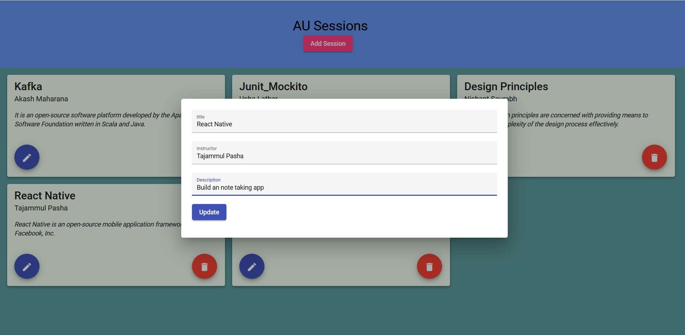
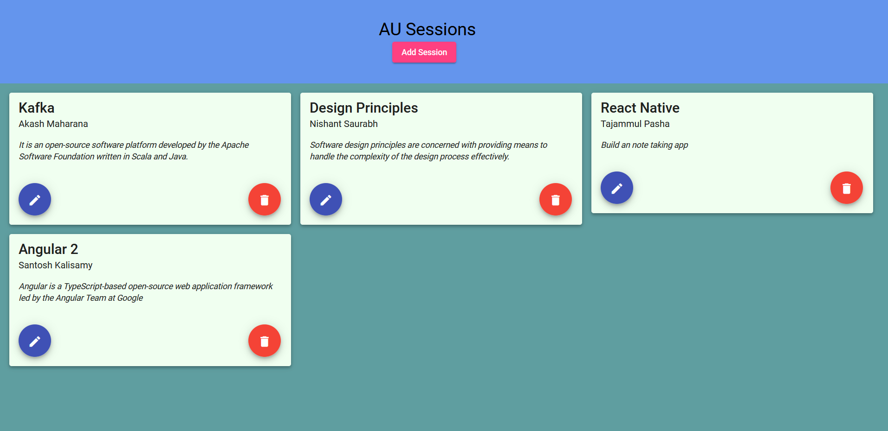

# Angular Assignment Workflow

Both [Source Code](./sessions-app/) and zip file of source code is available.

1. **Home Page where all Sessions details are listed.**

2. **Adding a new Session by clicking on add Session. It will only be added when title and instructor name is not empty**

3. **Page after adding session**

4. **Editing the react native session description**

5. **Page after editing the details**

6. **Page after deleting the Junit_Mockito Session**

