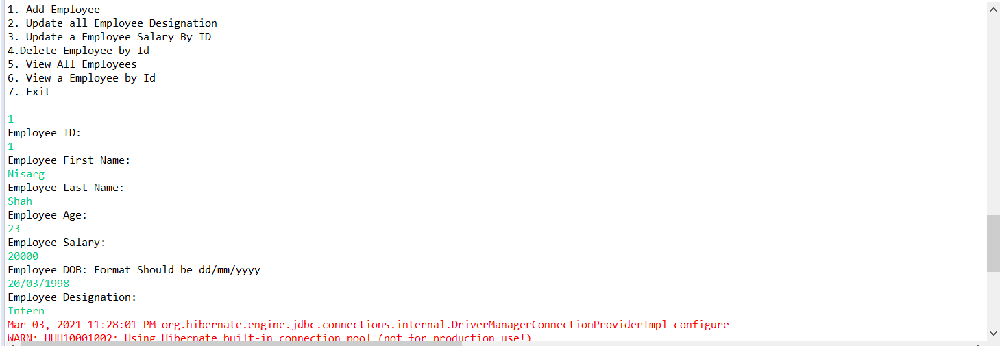
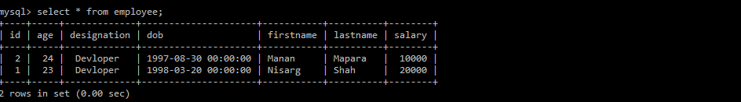
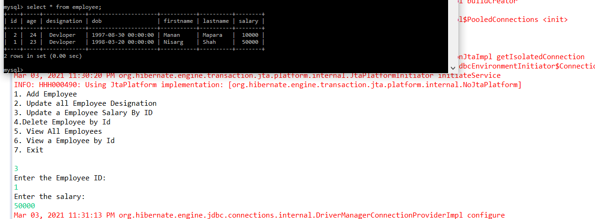
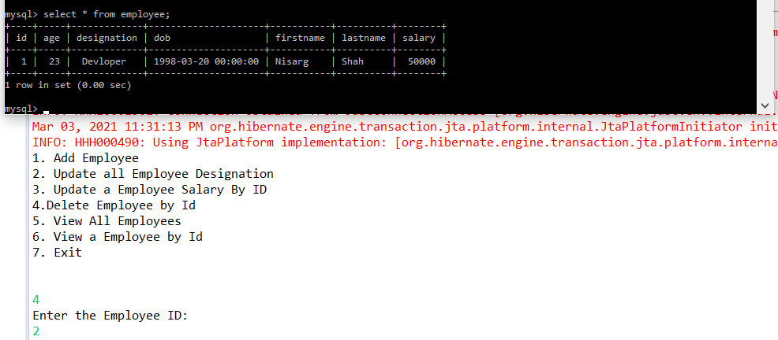
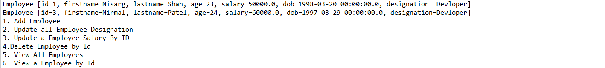

# Hibernate Assignment 1

1. Add a Employee
Input

Output

2. Update all Employee Designation to Developer

3. Update a Employee Salary By Id

4. Delete a Employee By Id

5. Get All Employees

6. Get Employee By Id

