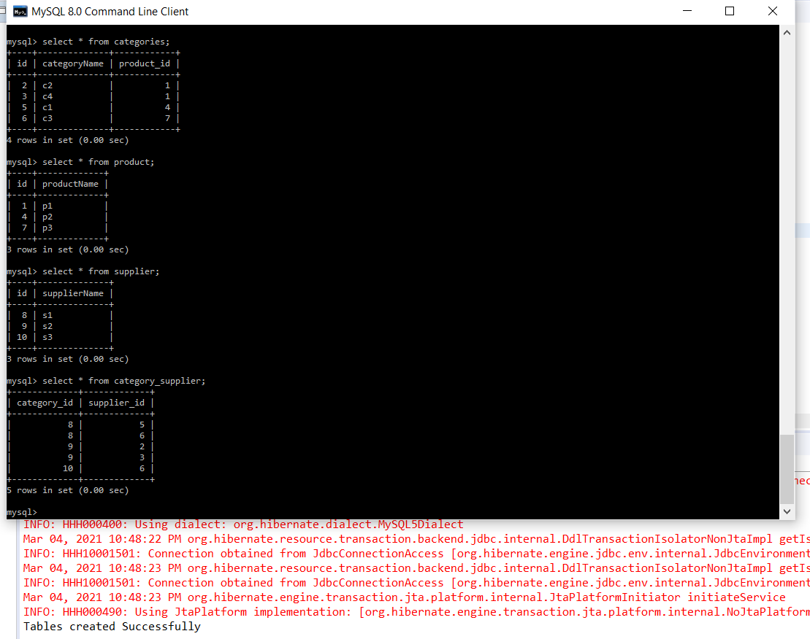
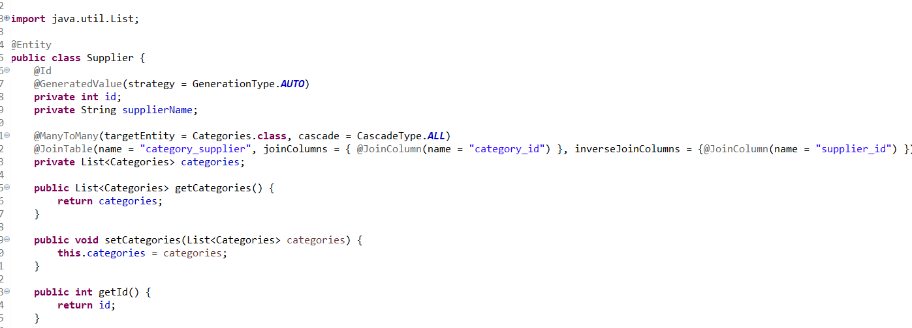
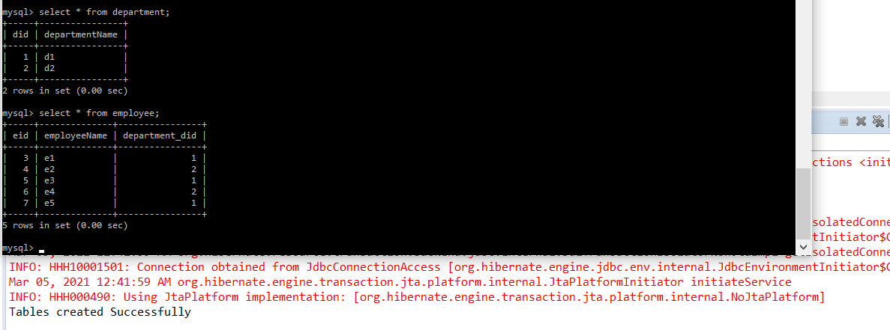

# Hibernate2 Assignment

1. Ecommerce Product Management

2. Many To Many Problem was solved between supplier and categories class using this code.

3. Many To One can be seen between Employee-Department Relationship i.e. Many Employees can have 1 department

