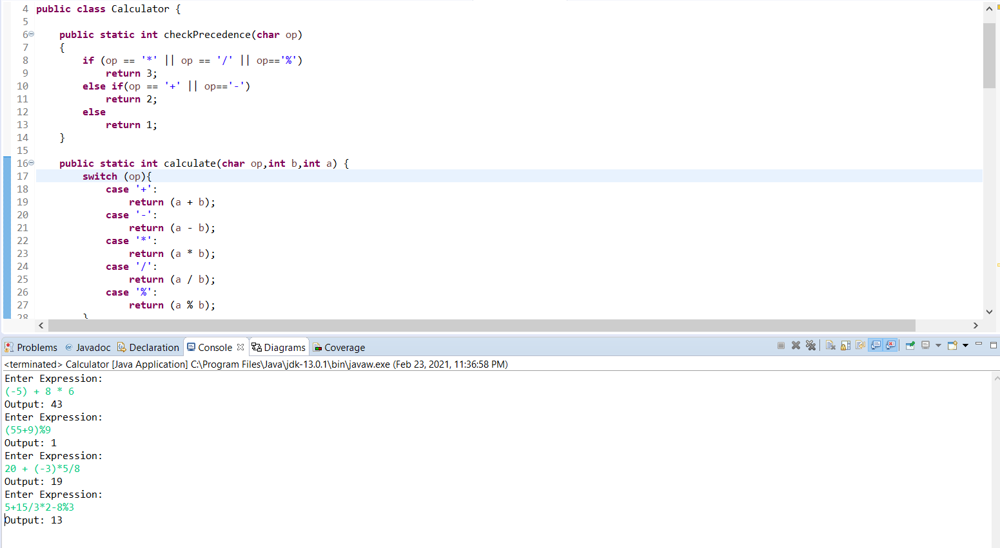
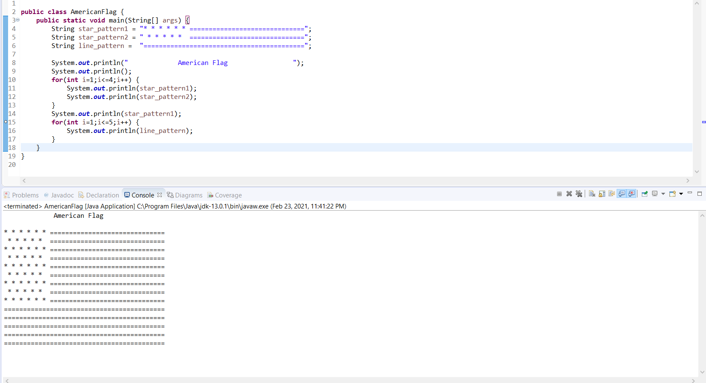
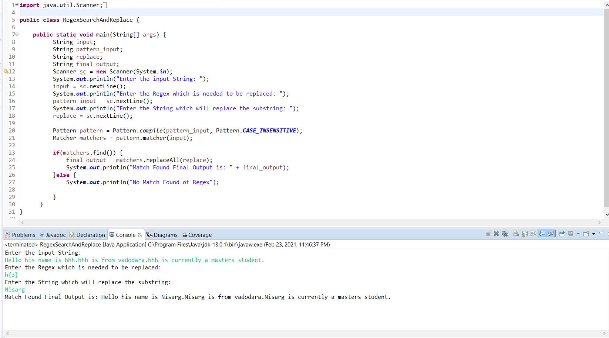
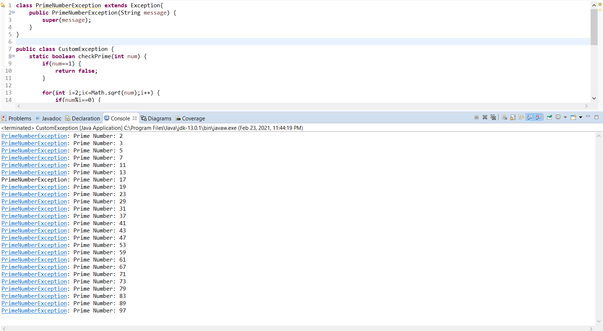
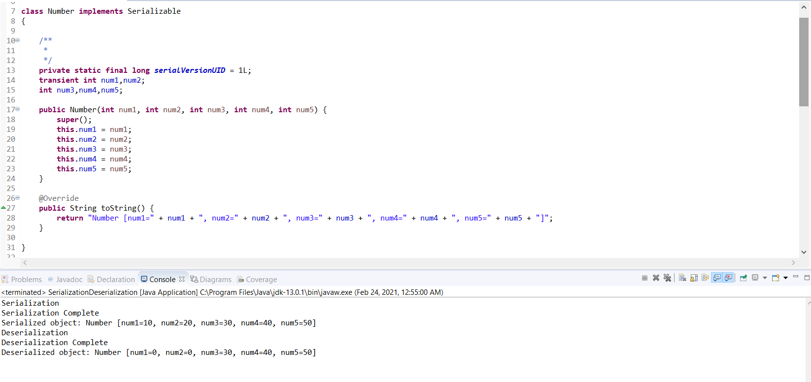

# JAVA ASSIGNMENT
1. Write a Java program to print the result of the following operations.
    a. -5 + 8 * 6    
    b. (55+9) % 9    
    c. 20 + -3*5 / 8    
    d. 5 + 15 / 3 * 2 - 8 % 3  
[Source Code](./SlidesQuestions/src/Calculator.java)  
Output:

2. Write a Java program to print an American flag on the screen. 
[Source Code](./SlidesQuestions/src/AmericanFlag.java)
Output:

3. Write a Java program to replace each substring of a given string that matches the given regular expression with the given replacement.
[Source Code](./HandsOnQuestions/src/RegexSearchAndReplace.java)
Output:

4. Write a Java program to get a reverse order view of the keys contained in a given map
[Source Code](./HandsOnQuestions/src/ReverseOrderCollection.java)
Output:

5. Write your own unchecked Exception and throw it from you counter programme which counts 1 to 100.When you get Prime no while counting then throw this Exception and catch this to print you exception message.
[Source Code](./HandsOnQuestions/src/CustomException.java)
Output:

6. Write a programme to serialize 3 fields out of 5 and deserialize it. Use UUID to prvent object mutation.
[Source Code](./HandsOnQuestions/src/SerializationDeserialization.java)
Output:
