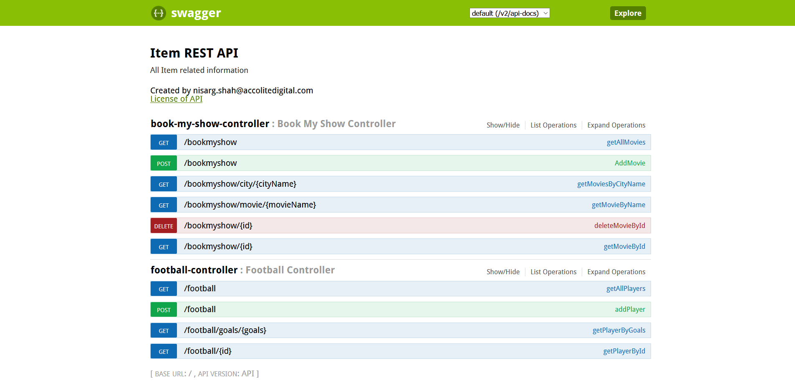

# NoSQL Assignment

1. Created Two Controllers BookMyshow and Football

It contains all the features like.
- search movies by name
- search movies by city name
- insert movie
- delete movie
- get the names of the footballers having more than 10 goals in a year

2. Screenshot of data added in couchbase

3. Create Primary index on id

4. Drop index id

