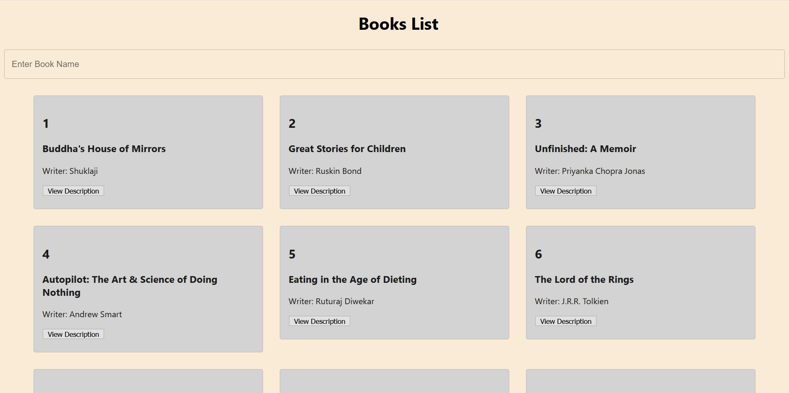
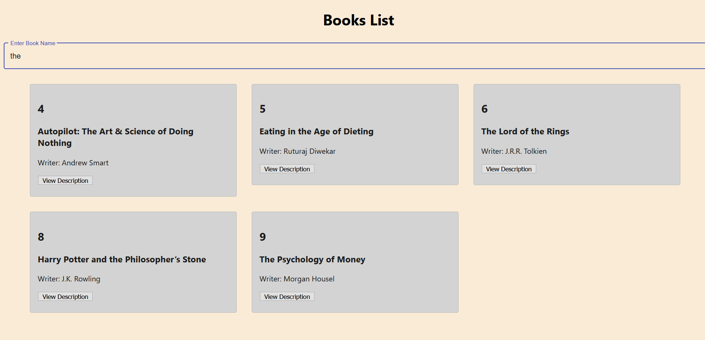
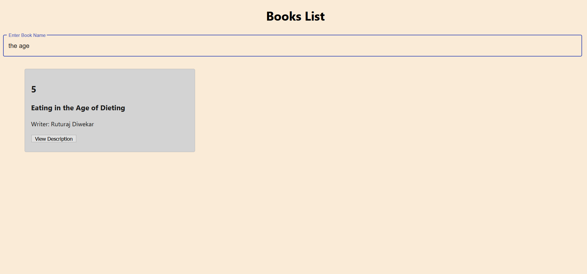
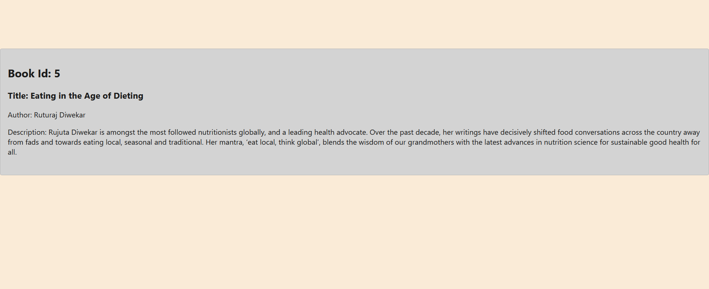

# React Assignment
Create an app that will show a list of books available in a store add click functionality to list items 
when user click user should navigate to new route where user can see the details of book(name,author,etc) 
add a search functionality.

[Working Video](./BookSearchWorkingVideo.mp4)

**Project Screenshots**
1. Home Page/Displaying all Books

2. Search Functionality

3. Description of Book after clicking on it

