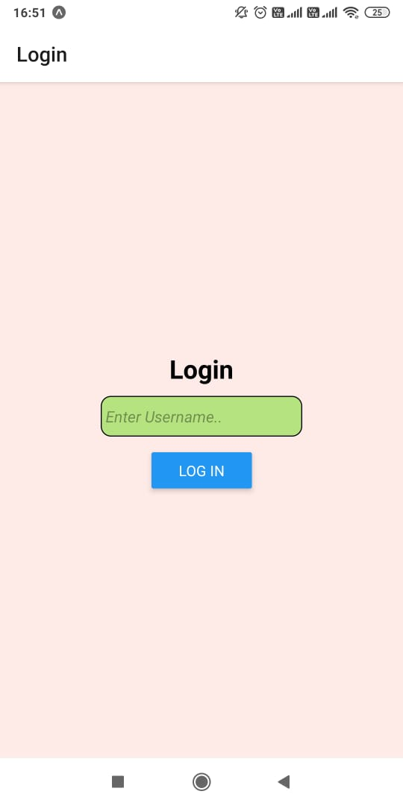
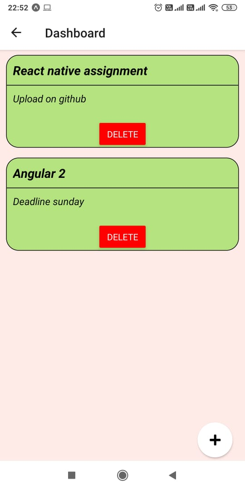
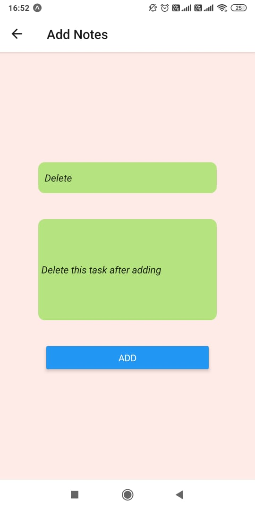
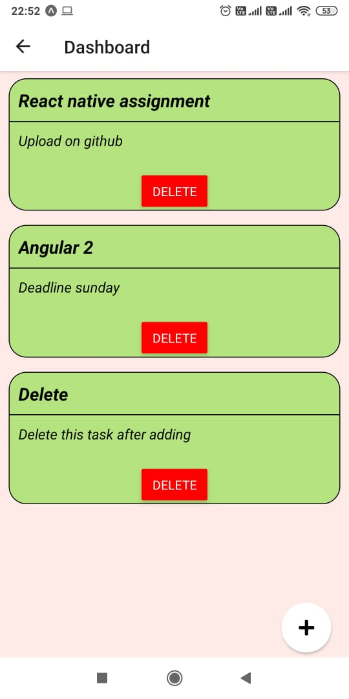
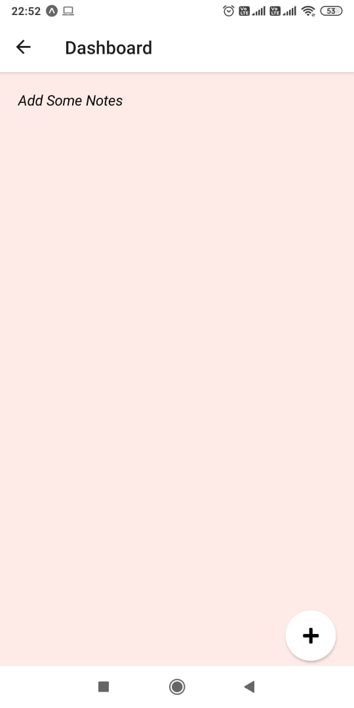

# Notes App using React Native
**Build a simple note taking app with following set of features**
**Login, List and Add Note screens**

[Working Video](./NotesApp_Working_Video.mp4)

**Project Screenshots**
1. Login Page

2. Dashboard After adding 2 notes

3. Add Notes Page and adding one more note

4. Dashboard Page after step 3.

5. Dashboard Page after deleting all notes

